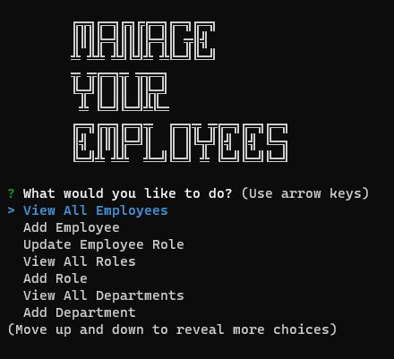

# Manage Your Employee's

## Description

Prompts user to view employees, roles, and departments or add emplyees, roles, and departments. Thus having the ability to easily manage your employee database.

## Table of Contents

* [Installation](#installation)
* [Usage](#usage)
* [Contributing](#contributing)
* [Tests](#tests)
* [Questions](#questions)

## Installation

Once the project is downloaded type "npm i" into your command line to download the neccesarry inquirer, mysql2, and cosole.table dependencies.

## Usage

Run 'node index.js' on the cmd line to start the application which will then use inquirer to prompt questions allowing you to make changes to your employee's. You can vie your updated database anytime by view the corresponding table.

## Contributing

Standard practice for contribution.

## Tests

No test available at this time.

## Questions

If you have an questions feel free to contact me via [Email](dsapione@gmail.com)
and checkout my other projects on [GitHub](https://github.com/dsapione).
